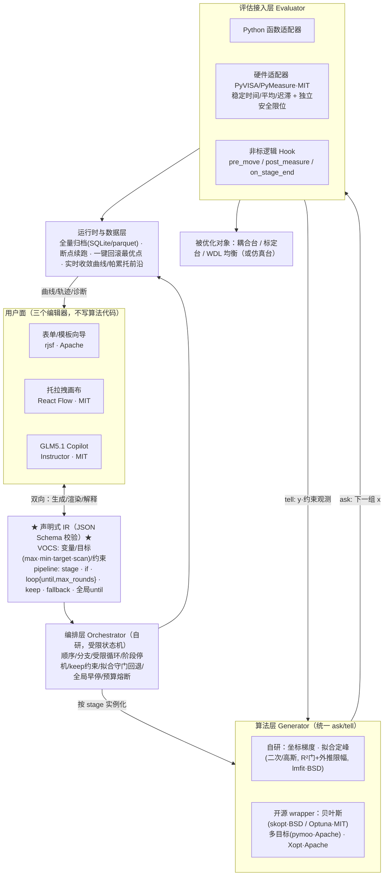

# 最终架构方案 · 光器件优化算法平台

> 场景：光器件耦合 / 标定 / WDL 均衡等硬件在环优化。
> 商业约束：闭源交付给客户，依赖必须全为 permissive license（MIT/BSD/Apache），零 GPL/SUL 传染。
> 本文是全部架构讨论的最终收敛版，代码骨架已可运行（`python run_demo.py` / `streamlit run app.py`）。

---

## 0. 三条不可动摇的架构公理

1. **声明式 IR 是唯一真相（Single Source of Truth）**
   问题定义（VOCS）+ 编排流水线（pipeline）= 一份带 JSON Schema 的声明式配置。
   表单、托拉拽画布、GLM5.1 Copilot 都只是这份 IR 的"编辑器"；执行引擎只认 IR，永不认 UI。
   → 三种入口可互相翻译、随时切换；配置天然可版本化、可复现、可归档。

2. **算法层统一 ask/tell 接口，算法尽量用开源，编排必须自研**
   `ask()` 给下一批候选点，`tell(x, score)` 回填结果——算法完全不知道 f 是仿真还是真实电机。
   贝叶斯/多目标这类难写易错的算法从开源接（Optuna/skopt/Xopt/pymoo，全 permissive）；
   编排状态机（if/loop/keep/守门/回退）是全平台唯一没有开源对应物的部分，也是差异化核心，自研且保持薄。

3. **安全护栏独立于算法与编排，且不可关闭**
   受限 DSL（非图灵完备）：loop 强制 `max_rounds`、stage 强制 `max_iter`、全局评估预算熔断；
   条件表达式白名单求值（asteval），不执行任意代码；
   硬件安全限位在 Evaluator 层独立实现，任何算法/编排都不能突破。
   LLM 只生成"候选配置"，必须过 schema 校验 + 用户确认才执行，绝不直接触发硬件动作。

---

## 1. 分层总图



## 2. 各层最终决策

### 2.1 声明层 VOCS（已实现 `optplat/vocs.py`）
- 变量：任意个数，范围 + 可选分辨率；目标：任意个数，四种 mode 统一
  （maximize / minimize / **target**（转 `-|y-t|` 或代理模型反解）/ **scan**（退化为扫描生成器，产特性曲线））。
- 约束两类：**硬约束**（提点时过滤，如安全区）与**软约束/keep**（违反则罚分+回退，如 `y1 > k`）。
- Pydantic 建模 → 自动导出 JSON Schema，同一份 schema 驱动表单生成、LLM 输出校验、后端校验（三处一源）。

### 2.2 算法层 Generator（已实现 6 种 + wrapper 路线）
- 统一 `ask()/tell()/done/failed/best_x`，与 Xopt 接口兼容——将来可直接挂它的 generator。
- **已实现算法库**（`optplat/generators.py`，全部 ask/tell，仅依赖 numpy/scipy/lmfit）：

  | algorithm | 类别 | 说明 |
  |---|---|---|
  | `grid_scan` / `line_scan` | 找光 (Phase 1) | 栅格/线扫描，配 stage `stop.target` 到阈值即停 |
  | `coordinate_descent` | 局部优化 | compass search + 步长收缩 |
  | `nelder_mead` | 局部优化 | 单纯形下降（reflect/expand/contract/shrink，ask/tell 驱动） |
  | `quadratic_fit` / `gaussian_fit` | 标准拟合定峰 | 最小二乘（lmfit）全自由拟合，**R² 守门 + 外推限幅**，score 空间统一覆盖 max/min/target |
  | `parametric_fit` (公式法/非标拟合) | 带先验的拟合 | 把**已知参数钉死**（顶点/σ/曲率），只解自由参数；支持**自定义模型表达式**（客户非标公式）；参数钉够即退化成"公式"。lmfit `vary=False` + `ExpressionModel` |
  | `formula` | 解析特例 | 三点抛物线闭式解峰，**无回归**（= 参数全被点数定死的 parametric_fit 特例） |
  | `bayesian` | 贝叶斯(OSS) | Optuna(MIT) TPE/GP，`n_calls` 内探索-利用，全局优化 |

- **开源 wrapper（已接入 + 待接入）**：
  - ✅ `bayesian` → **Optuna(MIT)** TPE/GP，`optplat/bayes.py`，惰性导入保持核心纯净；native ask/tell 1:1 映射。
  - 待接：多目标帕累托→pymoo(Apache)；更多无梯度→Nevergrad(MIT)；成熟组合→Xopt(Apache)。每个 ≈ 几十行。
- 客户自定义算法 = 实现同一基类，entry_points 注册为插件。

### 2.3 编排层 Orchestrator（已实现 `optplat/orchestrator.py`，自研核心）
- 模型：**受限状态机**（不是 DAG——优化需要回边循环；不是通用脚本——硬件不允许图灵完备）。
- 算子集固定五个：`stage` / `if-then-else` / `loop{body, until, max_rounds}` / stage 级 `stop{max_iter, target}` / pipeline 级全局 `until`（任意时刻满足即整体早停）。
- stage 语义：冻结其余变量，只把本 stage 的变量子集交给 generator；结束时把操作点移到最优可行点。
- `keep` 约束：违反罚分（后续升级为贝叶斯的可行性感知采集函数）；`fallback`：拟合守门失败自动降级坐标梯度。
- YAML 嵌套块 ↔ 画布控制节点是同一状态机的两种同构视图。

### 2.3.1 两种 IR、一个执行核（块 / 图，Dify 风格）

编排引擎是 **JSON 驱动**的，同一份 `StageEngine`（`optplat/engine.py`）被两种前端复用：

| IR 形态 | driver | 适合 |
|---|---|---|
| **嵌套块** `flow: [stage, if{then/else}, loop{body,until,max_rounds}]` | `Orchestrator` | 表单 / YAML / 手写 |
| **节点+连线图** `{nodes, edges}` | `GraphRunner`（`optplat/graph.py`） | **托拉拽画布（React Flow）直接产出的 JSON** |

图直接当状态机跑，**无编译步骤，JSON 即可运行**：
- **分支**：节点的出边按序判断，第一个 `condition` 为真的边胜出，否则走无条件默认边（= if/switch）。
- **循环**：一条边指回先前节点即回环，`condition` 为真时继续循环；受 **节点 `max_visits` + 全局 `max_steps`** 双重限幅（无死循环）。
- `to_mermaid(graph)` 可把图渲染出来（画布落地前的替身视图）。

这就是你要的"生成 JSON → 类 Dify → 运行"：画布只负责产 `{nodes,edges}` JSON，`GraphRunner` 直接执行。

### 2.3.2 算法即插件（registry，"定好接口就能接上"）

`optplat/registry.py` 是算法节点的插件契约。每个算法声明 **参数 schema + builder**，引擎从不 hard-code 算法名——只调 `build_generator()`。

- **画布读取** `algorithm_catalog()` 自动生成节点面板 + 每个节点的配置表单。
- **接自己的算法**：实现 `Generator`（`ask/tell/done/best_x` 四件套），`register_algorithm(AlgorithmSpec(...))` 注册，立刻成为可拖拽节点并能在任意图/流水线里运行——**引擎零改动**（已测：自定义 random_search 插件直接跑通）。

```python
class MyGen(Generator): ...            # ask()->下一组x, tell(x,score), done, best_x
register_algorithm(AlgorithmSpec(
    name="my_algo", category="custom", single_var=False,
    params={"gain": {"type": "float", "default": 1.0}},
    builder=lambda vocs, step: MyGen(vocs, step["variables"], step["objective"],
                                     gain=step.get("gain", 1.0))))
```

### 2.3.3 托拉拽画布（前端，React Flow·MIT）——落地方式

后端已就绪，前端是一层薄壳：
1. 画布调后端 `algorithm_catalog()` 拿到算法清单+参数 schema → 渲染左侧节点面板与配置表单。
2. 用户拖拽连线 → 前端序列化成 `{nodes, edges}` JSON（就是 `workflow_graph_example.json` 那种）。
3. JSON POST 给后端 → `GraphRunner(...).run()` 执行 → 回传 events/收敛曲线/最优点。
4. 保存/版本化/分享的就是这份 JSON。React Flow(MIT)、rjsf(Apache) 均 permissive。

### 2.4 评估接入层 Evaluator（函数版 + 硬件版均已实现）
- 契约：`evaluate(dict[x]) -> dict[y]`，自变量/因变量数目任意；全量历史自动归档。
- ✅ `HardwareEvaluator`（`optplat/hardware.py`）：duck-typed `stage.move()` + `meter.read()`；
  内置**稳定时间**、**多次平均**（抗噪）、**独立安全限位**（默认 clamp 到安全区，`strict=True` 则拒绝并抛错——
  任何算法/编排 bug 都无法命令越界运动）。附带 `SimulatedStage/SimulatedMeter`（可注入噪声）无硬件即可跑测。
- 真实后端：PyVISA/PyMeasure(MIT) 写个 move/read 薄类即可；非标逻辑通过 Hook 注入，不改平台代码。
- P1c 加异步/批量接口（贝叶斯 batch 采样与多通道并行需要）。

### 2.5 用户面（三个编辑器）+ GLM5.1 定位
- **模板库优先**：「首光→定峰」「WDL 多通道均衡」「标定扫描」预置流程，客户选模板填 3~5 个旋钮
  （拟合 R² 阈值、信赖域半径、采样图案、平均次数都做成模板默认值+高级项）。行业 know-how 沉淀在这，是付费点。
- 表单由 JSON Schema 自动生成（rjsf）；画布用 React Flow(MIT)，节点↔IR 双向绑定；
- GLM5.1 三个用法：**意图→IR**（Instructor 结构化输出，schema 不合规自动重试）、**IR→人话解释+体检**、**跑后诊断**（读归档数据给建议）。边界：LLM 永远只产候选配置，经"渲染→校验→用户确认"才执行。

### 2.6 运行时与数据层（✅ SQLite 持久化已实现）
- ✅ `SQLiteStore`（`optplat/store.py`，纯 stdlib）：归档每次评估（run_id, seq, stage, point, objectives, ts）；
  **断点续跑**（`Orchestrator(start_point=store.best(...))` 从归档最优点继续）；
  **一键回滚**（`rollback_to_best()` 驱动电机回到历史最优点，异常/中止后用）。
- 待做：实时收敛曲线已在 Streamlit；多目标帕累托前沿随 pymoo 接入；归档数据喂代理模型（target/建模类任务）。

## 3. License 红黑榜（已核实）

| 结论 | 组件 | License |
|---|---|---|
| 🔴 禁用 | Badger（编排+GUI 思路可参考，代码不可碰） | GPL-3.0 |
| 🔴 禁用 | n8n（明文禁止嵌入产品/向客户提供） | Sustainable Use License |
| 🟡 可用但不选 | Node-RED（license 干净，但消息流模型不匹配迭代优化+硬件在环，且 Node.js 与 Python 算法割裂） | Apache-2.0 |
| ✅ 采用 | Xopt · pymoo · Streamlit · rjsf | Apache-2.0 |
| ✅ 采用 | Optuna · Nevergrad · React Flow · Instructor · PyVISA · asteval · pydantic · pyyaml | MIT |
| ✅ 采用 | scipy · numpy · lmfit · scikit-optimize · pandas | BSD-3 |

本仓库不放 LICENSE 文件：闭源产品，无 license = 保留所有权利。

## 4. 自研 vs 开源 最终分界

**自研（护城河，约 20% 工作量）**：编排状态机 + 受限 DSL、拟合定峰家族、光器件模板库、GLM5.1 Copilot 集成、非标硬件适配器。
**开源装配（约 80%）**：全部通用算法、拟合底层、表单/画布 UI 组件、LLM 结构化输出、仪器通信。

## 5. 路线图

| 阶段 | 内容 | 状态 |
|---|---|---|
| **P0 · MVP** | VOCS + 坐标梯度 + 拟合定峰(R²门/限幅/回退) + if/loop/until 编排 + keep 约束 + Streamlit + YAML IR | ✅ 已完成并跑通 |
| **P1a · 算法库** | 找光扫描(grid/line)、Nelder-Mead、公式法(三点解析)；两阶段"找光→优化"流程；回归测试 | ✅ 已完成（6 种算法，两阶段 62 次评估收敛，5 tests 通过） |
| **P1b · 硬件+持久化** | Optuna 贝叶斯 wrapper(TPE/GP)、PyVISA/仿真硬件适配器 + 稳定时间/平均/独立安全限位、SQLite 归档/续跑/回滚 | ✅ 已完成（11 tests 通过；含 global-until 状态一致性修复） |
| **P1c · 图运行时+插件** | node+edge 图 IR + `GraphRunner`（分支/受限循环，Dify 风格，JSON 直接执行）；算法插件 registry（自定义算法零改动接入）；graph→mermaid | ✅ 已完成（16 tests；含自定义算法插件、受限循环、分支测试） |
| **P2 · 服务化** | FastAPI(MIT) 后端：`/catalog` `/vocs` `/run/graph` `/run/pipeline`（`optplat/api.py`） | ✅ 已完成（7 API 测试） |
| **P2 · 画布前端** | 托拉拽画布（`web/index.html`，纯 vanilla JS+SVG，无 CDN，离线可用）：读 `/catalog` 建节点面板，拖拽连线产 `{nodes,edges}` JSON，POST `/run/graph`，出收敛曲线/轨迹 | ✅ 已完成（服务于 `/`；node --check 通过） |
| **P1d · 多目标** | pymoo NSGA-II wrapper、异步/批量 Evaluator | 下一步 |
| **P2 · 易用性** | JSON Schema 正式化 + rjsf 表单、场景模板库、GLM5.1 Copilot（意图→IR / IR→人话 / 跑后诊断） | |
| **P3 · 平台化** | React Flow 画布（节点↔IR 双向）、FastAPI 服务化 + 多用户/任务队列、scan 模式与建模类任务闭环 | |

## 6. 已知简化与升级路径（诚实清单）

- keep 约束目前是 `-1e9` 罚分 → 升级为可行性感知（贝叶斯 constrained acquisition / 回退到最近可行点）。
- 编排是树遍历执行器（够用）→ 需要 `goto/on_fail` 跨节点跳转时升级为显式状态机表（`transitions`·MIT）。
- Evaluator 同步单点 → P1c 加 async/batch（贝叶斯 batch / 多通道并行）。
- ✅ 历史已落 SQLite（含续跑/回滚）；parquet 导出可选。
- 多目标目前靠"分阶段+keep"标量化 → 真帕累托需求出现时接 pymoo（P1c）。
- `scan` mode 已在 schema 中占位，执行器 P3 实现。
