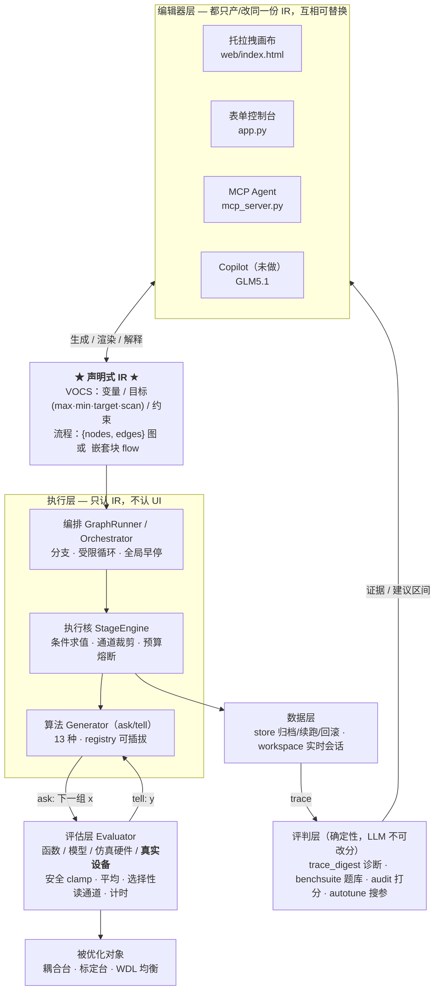

# 架构 · 光器件优化平台

> 场景：光器件耦合 / 标定 / WDL 均衡等**硬件在环**优化。
> 约束：闭源交付客户，依赖全部 permissive（MIT/BSD/Apache），零 GPL/fair-code。
> 本文是提纲。图文一页纸看 `docs/architecture.html`（主干图 + 扩展点地图），逐字段接口看
> `skills/device-interface/`，Agent 用法看 `MCP_AGENT.md`，当前进度与决策看 `CLAUDE.md`。
> 不带技术背景的介绍（给业务方/领导）看 `docs/intro.html`。

---

## 0. 一句话

**声明式 IR 是唯一真相；所有界面都只是它的编辑器；执行核只认 IR；算法、硬件、模型、评判都是可插拔件；安全与打分两条底线独立且不可绕过。**



---

## 1. 五条公理（改架构时先看这里）

| # | 公理 | 为什么不能破 |
|---|---|---|
| 1 | **IR 是唯一真相** | 表单/画布/Agent/Copilot 都只是编辑器。IR 可版本化、可复现、可归档、可互相翻译；一旦让某个 UI 持有独占状态，四个入口立刻分叉 |
| 2 | **算法统一 ask/tell** | `ask()→下一组 x`、`tell(x, score)→回填`。算法永远不知道 f 是仿真、代理模型还是真实电机——这是"换算法/换硬件互不影响"的根 |
| 3 | **编排自研且薄** | 通用算法有开源，**"迭代优化 + 硬件在环 + 受限循环"的编排没有**。这是差异化，也是唯一必须自己扛的复杂度，所以要保持薄：算子集固定，不做图灵完备 |
| 4 | **安全护栏独立、不可关闭** | 限位在 Evaluator 层 clamp；loop 强制 `max_visits`/`max_rounds`；全局 `max_steps`/`eval_budget` 熔断；条件表达式走 asteval 白名单而非 `eval`。**任何算法或编排的 bug 都不能命令越界运动** |
| 5 | **打分确定性，LLM 只读证据** | 审计/诊断产出证据，分数由固定题库确定性算出。若允许 LLM 影响评分，"优化算法"会退化成"优化如何说服裁判" |

---

## 2. 分层：职责、契约、代价

自上而下，每层只依赖下一层的**契约**，不依赖其实现。

| 层 | 职责 | 对外契约 | 文件 | 换掉它的代价 |
|---|---|---|---|---|
| **编辑器** | 让人/Agent 表达意图 | 产出合法 IR | `web/index.html` · `app.py` · `mcp_server.py` | **低**。四个并存已验证；再加一个不动后端 |
| **IR** | 唯一真相 | Pydantic schema | `vocs.py` + 图/块 JSON | **高**。改它牵动全部——加字段用**向后兼容的可选项** |
| **编排** | 分支 / 受限循环 / 早停 | 吃 IR，驱动执行核 | `graph.py`(图) · `orchestrator.py`(块) | **中**。两种 IR 形态共用一个执行核，加第三种也只是新 driver |
| **执行核** | 跑一个 stage：条件求值、通道裁剪、预算、记账 | `run_stage(step)` | `engine.py` | **高**。全平台唯一的执行路径，所有入口最终都落到它 |
| **算法** | ask/tell 出候选点 | `Generator` 四件套 | `generators.py` · `bayes.py` · `registry.py` | **低**。注册即用，见 §3.1 |
| **评估** | 给 x 得 y | `evaluate(x, stage, channels) -> {y}` | `evaluator.py` · `hardware.py` · `userdev.py` · `models.py` | **低**。函数/模型/仿真/真实设备四种实现同一契约 |
| **评判** | 诊断、打分、搜参 | 读 trace，产确定性分数 | `trace_digest.py` · `benchsuite.py` · `audit.py` · `autotune.py` | **低**。旁路，不参与运行时 |
| **数据** | 归档、续跑、回滚、实时同步 | `store` / `workspace` | `store.py` · `workspace.py` | **低**。SQLite 可换 |

**读法**：代价"低"的层是设计好的**可换件**；代价"高"的两层（IR、执行核）是承重墙——演进要往可换件上加，而不是把承重墙改宽。

---

## 3. 可演进性：八个扩展点

这是本架构的核心资产。**加东西时先在这张表里找缝，找不到缝再谈改平台。**

| 想加什么 | 往哪加 | 平台要改吗 | 已验证 |
|---|---|---|---|
| 新算法 | `register_algorithm(AlgorithmSpec(...))` | **零改动** | 自定义 `random_search` 插件直接跑通 |
| 新硬件 / 换仪器 / 增减 x·y | 外部设备文件 `AXES` + `METERS` | **零改动** | `run_device.py` + `OPTPLAT_DEVICE` |
| 一次采集出多个 y | `Source(...).meter(y, key)` | **零改动** | 双通道功率计，4 项测试 |
| 新"给 x 出 y"的来源（代理模型/客户数据/GP/神经网络） | `register_model(kind, builder)` | **零改动** | `analytic` · `dataset_idw` |
| 新界面 / 新入口 | 只要产合法 IR | **零改动** | 画布 · 表单 · MCP Agent 并存 |
| 运行时**观察**（实时显示/日志/远程监视） | `StageEngine.on_eval` 观察者钩子 + 新端点 | **零改动语义**（纯旁观，有测试锁住） | `/run/graph/stream` SSE → 画布实时状态 |
| 新目标模式（除 max/min/target/scan） | `ObjectiveMode` + `Objective.score()` | **改一处**（枚举 + 打分），算法自动跟随 | `target` 模式已贯通 |
| 新编排算子（如 `goto`/`on_fail`） | `graph.py` 节点类型 + 执行核分派 | **改两处**，且必须自带限幅 | 分支/回边已有 |
| 新的**测量/表征**能力（不是优化） | `register_algorithm` + 一个核心模块 + 面板 | **零改动**（走 `StageEngine.evaluate`） | 灵敏度采集 `sensitivity.py` |
| 新评判维度 / 新题库 | `benchsuite` 加题、`trace_digest` 加失效模式 | **零改动**（题库有指纹校验） | DEV 4 题 + FROZEN 7 题 |

### 3.1 加算法（最常用的缝）

```python
class MyGen(Generator): ...          # ask() -> 下一组 x；tell(x, score)；done；best_x
register_algorithm(AlgorithmSpec(
    name="my_algo", category="refine", single_var=False,
    params={"gain": {"type": "float", "default": 1.0, "label": "增益"}},
    builder=lambda vocs, step: MyGen(vocs, step["variables"], step["objective"],
                                     gain=step.get("gain", 1.0))))
```

注册后**同时**获得：画布左栏可拖拽节点、由 `params` 自动生成的配置面板、可在任意图/流水线里运行、
被自动调优纳入变异空间（按 `category` 归相）、被 MCP Agent 通过 `list_algorithms` 看见。
**引擎从不 hard-code 算法名**——只调 `build_generator()`，这是"零改动"的机制来源。

### 3.2 接硬件（第二常用）

平台与仪器之间只有三个方法：`axis.move(v)` / `axis.get()` / `meter.get()`。
写一个设备文件导出 `AXES` + `METERS`，`load_device()` 自动读出有几个 x、几个 y 并建好 VOCS 与 Evaluator。
完整规范（决策表、四条不变量、冒烟自检、症状对照）见 **`skills/device-interface/`**，图文版 `docs/device-interface.html`。

### 3.3 加"给 x 出 y"的来源

`models.py` 的 ModelProvider 与算法 registry 同构：`register_model(kind, builder)` 返回一个 `f(x) -> {y}`。
客户采集的数据建成代理模型后，评估层、画布、自动调优全部照旧——**这是"先建模再优化"路线的接口**。

---

## 4. 一次运行发生什么（把各层串起来）

```
IR(图) → GraphRunner 逐节点走
  └─ 每个算法节点 → StageEngine.run_stage(step)
       ├─ 算本步真正需要的通道 = 目标 ∪ keep ∪ stop ∪ until ∪ targets 引用的 y
       ├─ 循环：generator.ask() → engine.evaluate(x, channels) → generator.tell(x, score)
       │        └─ Evaluator：安全 clamp → move → settle → 每轮平均前失效 Source 缓存
       │                      → 只读需要的通道 → 求平均 → 计时(同组并行/异组串行) → 归档
       ├─ 守门：stop{max_iter,target} · keep 违反罚分 · 拟合 R² 不达标则回退
       └─ 收尾：操作点移到最优可行点，记录 fit_info
  ├─ 边上的 condition 决定分支；回边即循环，受 max_visits + max_steps 双限幅
  └─ 全局 until 命中 → StopAll → 同步操作点后整体早停
→ result{state, objectives, n_evals, events, history, fits, reads, sim_seconds}
→ 画布画收敛/1D/2D 轨迹；store 归档；trace_digest 出诊断
```

**两个容易被忽略但很关键的设计**：

1. **通道裁剪**（`_needed_channels`）——只优化 y1 的步骤根本不去读 y2。在真实台架上，一次测量是秒级成本，这直接决定总耗时。
2. **缓存边界 = 一轮平均**——共享采集的缓存由平台掌握失效时机，所以 `averages=8` 仍是 8 次独立采集。用户自己缓存做不到这点。

---

## 5. 不变量（重构时的红线）

- 执行路径**只有一条**：任何入口最终都走 `StageEngine`。不要为某个前端开旁路。
- 安全限位、循环限幅、预算熔断**不提供关闭开关**，也不接受 IR 里的参数把它们调成无穷。
- 条件表达式只走 asteval 白名单，**永不 `eval`**；LLM 产出的 IR 必须过 schema 校验才能执行。
- 分数只由确定性题库产生；诊断可以给建议区间，但**越界会被 schema 夹回**。
- IR 加字段一律**可选 + 有默认**，老方案 JSON 必须还能跑（画布的方案库里有存量文件）。
- 新依赖先核 license，permissive 才用，并登记 `THIRD_PARTY_LICENSES.md`。

---

## 6. 演进路线（缝已经留好了，按需长）

| 方向 | 落在哪层 | 已留的缝 | 代价 |
|---|---|---|---|
| **真实仪器批量接入** | 评估 | 设备文件契约 + 规范 skill | 每台仪器一个薄类 |
| **多目标真帕累托** | 算法 | ask/tell 兼容；`register_algorithm` | 接 pymoo(Apache) ≈ 几十行 wrapper |
| **异步/批量评估** | 评估 | 目前同步单点 | 需扩契约为 batch，**会动到执行核**——最贵的一项 |
| **GLM5.1 Copilot（NL→IR）** | 编辑器 | `draft_workflow` 工具面已备；Hermes 路线已通 | 只加编辑器，后端不动 |
| **`scan` 模式执行器** | 执行核 | `ObjectiveMode.SCAN` 已占位 | 加一个"不求最优、只产曲线"的执行分支 |
| **客户数据建模闭环** | 评估 | `register_model` | 加 provider（GP/RBF/NN）即可 |
| **多用户 / 任务队列** | 数据 + 服务 | FastAPI + workspace 按 session 隔离 | 需要真队列时再上，别提前做 |
| **归档换后端** | 数据 | `store` 接口薄 | SQLite → parquet/PG |

**优先级建议**：真实仪器接入 > 客户数据建模 > 多目标 > 异步批量。前两项是客户价值，第三项是能力补全，第四项是性能优化且最贵——**没被真实测量时间卡住之前不要做**。

---

## 7. 已知简化与升级路径（诚实清单）

| 现状 | 何时该升级 | 升到哪 |
|---|---|---|
| `keep` 违反用大罚分 | 约束经常在边界附近被触发时 | 贝叶斯 constrained acquisition / 回退最近可行点 |
| 编排是树/图遍历执行器 | 需要跨节点 `goto`/`on_fail` 时 | 显式状态机表（transitions·MIT） |
| Evaluator 同步单点 | 贝叶斯 batch 或多通道并行成为瓶颈时 | async/batch 契约（会动执行核） |
| 多目标靠"分阶段 + keep"标量化 | 客户真要看前沿时 | pymoo NSGA-II |
| `dataset_idw` 是最朴素的代理 | 数据量上来、精度不够时 | GP / RBF provider |
| 画布无撤销/版本树 | 用户开始怕改坏方案时 | 方案 JSON 本就可版本化，加 UI 即可 |

---

## 8. License 底线

| 结论 | 组件 |
|---|---|
| 🔴 禁用 | **Badger**(GPL-3.0，思路可参考代码不可碰) · **n8n**(Sustainable Use License，明文禁止嵌入交付) |
| ✅ 采用 | Optuna · React Flow · Instructor · PyVISA · asteval · pydantic · pyyaml · MCP SDK（MIT）／scipy · numpy · lmfit · pandas · httpx（BSD）／Xopt · pymoo · Streamlit · FastAPI 生态（Apache/MIT） |

本仓库不放 LICENSE 文件：闭源产品，无 license = 保留所有权利。新增依赖先核实、后登记。

---

## 9. 自研 vs 开源的分界（护城河在哪）

**自研（≈20% 工作量，全部价值）**：编排状态机与受限 DSL、拟合定峰家族与守门回退、通道裁剪与共享采集的成本模型、
光器件场景模板库、审计-诊断闭环、设备接入契约。

**开源装配（≈80%）**：通用算法、拟合底层、Web 框架、结构化输出、仪器通信。

判断新功能该自研还是接开源，用一个问题：**它是否与"硬件在环 + 迭代优化"强耦合**？是则自研，否则找 permissive 的现成件。
