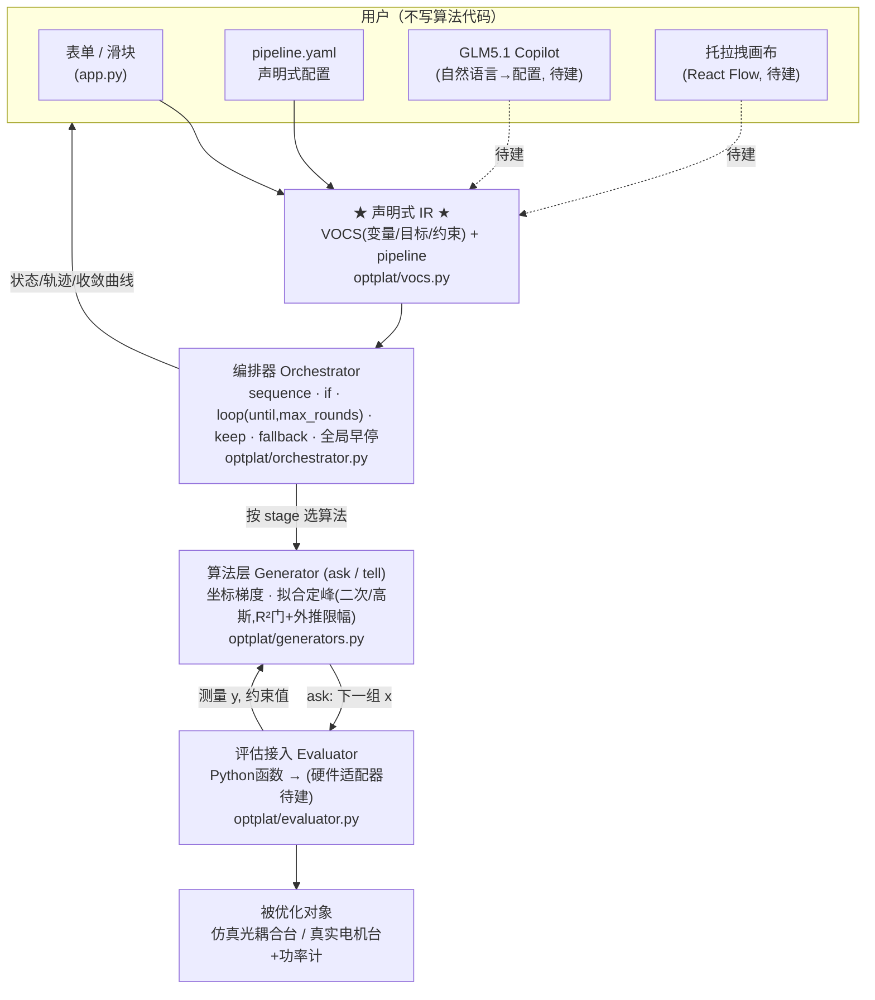

# 光器件优化平台 · MVP

一个轻量、**闭源友好**（依赖全为 MIT/BSD/Apache，零 GPL 传染）的优化算法平台内核。
让用户接入任意 `y = f(x)` 优化函数、选择不同算法、加约束、并把多步策略
（如"先优 y1，再优 y2 并保持 y1>k"）编排成带 `if / loop / 早停` 的流水线。

```bash
pip install -r requirements.txt
python run_demo.py            # 两阶段：找光(grid) → Nelder-Mead 精调 → 公式法均衡
python run_demo.py loop       # 交替循环 + keep 约束 + 拟合失败回退
streamlit run app.py          # 网页 UI（选工作流 + 实时收敛曲线）
python -m pytest -q           # 回归测试（6 种算法 + 2 条流水线）
```

## 典型流程（两阶段，已支持）

1. **Phase 1 · 找光**：`grid_scan`/`line_scan` 扫描到耦合功率阈值（stage 的 `stop.target`），一到首光即停。
2. **Phase 2 · 优化**：`nelder_mead` / `coordinate_descent` 精调；`quadratic_fit` / `gaussian_fit` / `formula`(公式法) 定峰；带 `keep` 约束与失败 `fallback`。

## 用户使用架构



**核心思想**：所有 UI（表单 / YAML / 未来的画布与 Copilot）都只是**同一份声明式 IR 的编辑器**；
执行引擎只认 IR，永不认 UI。这样三个入口可并行开发、互相翻译，且天然可版本化、可复现。

## 已实现（24h MVP）

| 层 | 文件 | 能力 |
|----|------|------|
| 问题声明 VOCS | `optplat/vocs.py` | 变量(范围)、目标(max/min/target)、约束 |
| 评估接入 | `optplat/evaluator.py` | Python 函数适配 + 全量历史归档 |
| 算法 Generator | `optplat/generators.py` | **6 种算法**：找光扫描(grid/line)、坐标下降、Nelder-Mead、拟合定峰(二次/高斯，**R² 守门+外推限幅**)、公式法(三点解析峰) |
| 编排 Orchestrator | `optplat/orchestrator.py` | 顺序 / `if` / `loop{until, max_rounds}` / stage 停机 / **keep 约束(罚分回退)** / **拟合失败 fallback** / **全局早停** / 评估预算熔断 |
| UI | `app.py` | 表单调范围、运行、实时收敛曲线、编排轨迹 |
| 配置 | `pipeline_example.yaml` | 声明式流水线（= 那个"先优 y1 再优 y2 保持 y1>k"的例子） |

**安全护栏**（硬件平台必需）：`loop` 强制 `max_rounds`（无死循环）；条件用 asteval 白名单求值（不执行任意代码）；全局评估预算熔断。

## 下一步（全部permissive，可干净接入）

1. **贝叶斯 / 多目标**：接 [Xopt](https://github.com/xopt-org)(Apache-2.0) 的 generator —— 已保持 ask/tell 接口兼容，无痛替换。
2. **真硬件**：`Evaluator` 换成 PyVISA/PyMeasure(MIT) 适配器 + 稳定时间/平均/迟滞逻辑。
3. **GLM5.1 Copilot**：自然语言 → IR（Pydantic schema 做护栏，不合规重试），及 IR → 人话诊断。
4. **托拉拽画布**：React Flow(MIT)，节点↔IR 双向绑定。
5. **光器件模板库**：首光搜索 / WDL 均衡 / 器件标定的预置流程。

依赖许可证清单见 [`THIRD_PARTY_LICENSES.md`](THIRD_PARTY_LICENSES.md)。
