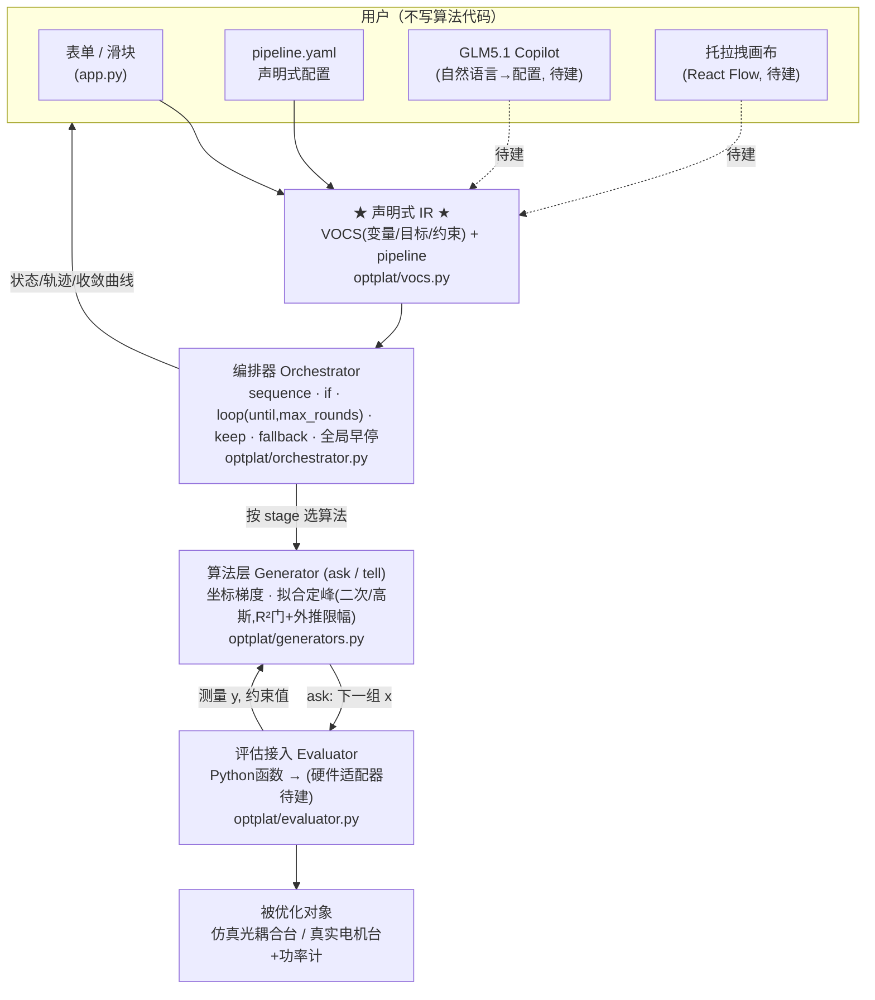

# 光器件优化平台 · MVP

一个轻量、**闭源友好**（依赖全为 MIT/BSD/Apache，零 GPL 传染）的优化算法平台内核。
让用户接入任意 `y = f(x)` 优化函数、选择不同算法、加约束、并把多步策略
（如"先优 y1，再优 y2 并保持 y1>k"）编排成带 `if / loop / 早停` 的流水线。

**上手请看 [`DEMO.md`](DEMO.md)**（交互界面 + 命令行演示的完整走法）。
**给非技术同事/领导看**：`docs/intro.html` —— 用业务语言讲清楚这平台解决什么问题、怎么衡量它（浏览器直接打开，离线可用）。

```bash
pip install -r requirements.txt
python -m optplat.api         # ★ 后端 + 托拉拽画布 → 打开 http://127.0.0.1:8003/
streamlit run app.py          # 表单式交互控制台（选工作流/算法/噪声/安全 + 实时曲线）
python run_demo.py            # 两阶段：找光 → Nelder-Mead 精调 → 公式法均衡
python run_graph.py           # 节点+连线图 JSON（Dify 风格）直接执行 + mermaid 预览
python demo_hardware.py       # 硬件接入 + 噪声/平均/安全 + 断点续跑 + 一键回滚
python run_device.py examples/device_template.py   # ★ 用外部定义的设备(轴 move/get + 测量 get)跑；平台自动读几个 x/y
                              #   接口规范见 skills/device-interface/，图文版 docs/device-interface.html
python run_mcp.py             # ★ L2 MCP 服务器 → 让 Agent 直接驱动平台（配置见 MCP_AGENT.md）
python -m pytest -q           # 回归测试（算法 + 块/图/API + 硬件/归档 + 自动调优 + MCP + 实时联动 + 外部设备 + 共享采集 + 灵敏度采集 + 找光/实时状态 + 审计，142 项）
```

## 用 Agent 驱动（L2 · MCP）

平台可作为 **MCP 服务器**被任意 Agent（内部 GLM5.1 / Claude Desktop / Cursor）驱动：新增算法节点、
加载以前的方案、跑仿真、对比不同策略、自动调优。启动 `python run_mcp.py`（stdio）或
`python run_mcp.py --http`（HTTP），配置与对接方式详见 **[`MCP_AGENT.md`](MCP_AGENT.md)**。

## 典型流程（两阶段，已支持）

1. **Phase 1 · 找光**：`grid_scan`/`line_scan` 扫描到耦合功率阈值（stage 的 `stop.target`），一到首光即停。
2. **Phase 2 · 优化**：`nelder_mead` / `coordinate_descent` 精调；`quadratic_fit` / `gaussian_fit` 定峰；带 `keep` 约束与失败 `fallback`。

### 自定义计算因变量

画布顶部点 **🧮 自定义因变量**，可以用外部接口测得的通道定义计算量，例如
`z1=y1+y2`、`z2=max(y1,y2,y3,y4)-min(y1,y2,y3,y4)`、`z3=y1-y2`。
表达式支持四则运算、幂、括号以及 `abs/min/max`，也可以引用先前定义的计算因变量。
计算量与原始 y 通道地位相同：可作为优化目标、keep/早停条件、灵敏度采集输出，或阻尼灵敏度矩阵求解的目标；
引擎会自动展开依赖，只读取公式真正需要的外部通道，计算量本身不计作一次仪器读取。

### 节点间观测仪

画布左栏提供三类可连线节点：**标量观测仪**（列出所选 y 的当前值）、**矩阵观测仪**（完整表格）和
**矩阵可视化观测仪**（选择每行或每列作为一个 feature 绘制曲线）。把它插在两个算法节点之间，流程走到该节点时会在
当前操作点重新采集；采集仍经过安全、平均、通道裁剪与成本记账。运行后点观测仪节点，结果显示在右侧属性面板，
可直观比较不同算法节点前后的效果。循环经过同一个观测仪时会保留每次快照，并显示最后一次及总观测次数。

外部因变量也可以直接声明为二维矩阵：设备 `Meter(..., value_type="matrix")`，或在画布左侧「通道规范」把类型切为
**矩阵**。平台会接收 list/tuple/NumPy 二维数组，归一化为 JSON 矩阵；多次平均时逐元素求均值。矩阵可交给矩阵观测仪
查看或按行/列画 feature 曲线，但不能直接作为标量优化目标——应先由设备或自定义计算通道提取一个标量 feature 再优化。

矩阵还可以进入 **矩阵模型控制器 (`matrix_policy`)**：它演示“矩阵测量 → 特征/模型推理 → 输出向量 → 自变量”的完整接口。
节点可选择展平、逐行均值或逐列均值作为特征；内置 `output = W·feature + b` 作为无深度学习依赖的示例模型，未来可把
推理函数替换成 CNN/Transformer。`output_map` 明确设置 `x1=output[2]`、`x2=output[0]` 等分配关系，输出既可作为
绝对位置，也可作为当前位置上的增量；最终命令仍经过每个自变量的范围裁剪及硬件安全限位。

自动调优结果中的每个候选策略都有 **▶ 演示**：按搜索时相同的噪声档、随机初始点和 seed 逐 Case 重放。界面可切换
Case 查看二维操作轨迹（黄点起始、绿点结束）和最终因变量的一维收敛曲线，并汇总成功 Case 数、质量均值/范围、
达标率、平均评估次数和平均测量耗时。详细轨迹仅在点击演示时生成，避免自动调优排名响应携带所有候选的大量历史。
演示图和右侧结果轨迹采用相同思路：2D 横轴、纵轴及收敛因变量都可选择；悬停采样点显示序号、阶段和精确坐标，
下方可展开完整采样点坐标表，方便逐点比较不同随机初始条件下的行为。

### 非标拟合 / 公式法（`parametric_fit`）

拟合时把**已知参数钉死**，只解自由参数（点更少、更稳）；还能吃**自定义模型表达式**，客户的场景专属公式直接插进来：

```yaml
- stage: balance_y2
  algorithm: parametric_fit
  variables: [x3]
  objective: y2
  model: "amp*exp(-((x-center)**2)/(2*sigma**2)) + offset"  # 自定义模型，也可填 gaussian/quadratic
  fixed: {sigma: 0.25}                    # 已知光斑宽度(器件特性)→钉死，只解 center/amp/offset
  hints: {center: {value: 0.5, min: 0, max: 1.5}}
  n_samples: 4
```

钉住 `sigma` 后 4 个点即解出峰位（实测 x3=0.600 精确命中）。参数钉够时就退化为闭式"公式"。

## 用户使用架构



**核心思想**：所有 UI（表单 / YAML / 未来的画布与 Copilot）都只是**同一份声明式 IR 的编辑器**；
执行引擎只认 IR，永不认 UI。这样三个入口可并行开发、互相翻译，且天然可版本化、可复现。

## 已实现（24h MVP）

| 层 | 文件 | 能力 |
|----|------|------|
| 问题声明 VOCS | `optplat/vocs.py` | 变量(范围)、目标(max/min/target)、约束 |
| 评估接入 | `optplat/evaluator.py` | Python 函数适配 + 全量历史归档 |
| 算法 Generator | `optplat/generators.py` | **7 种算法**：找光扫描(grid/line)、坐标下降、Nelder-Mead、标准拟合(二次/高斯，**R²守门+外推限幅**)、**非标拟合 `parametric_fit`**(钉死已知参数+自定义模型)、公式法(三点解析) |
| 编排 Orchestrator | `optplat/orchestrator.py` | 顺序 / `if` / `loop{until, max_rounds}` / stage 停机 / **keep 约束(罚分回退)** / **拟合失败 fallback** / **全局早停** / 评估预算熔断 |
| UI | `app.py` | 表单调范围、运行、实时收敛曲线、编排轨迹 |
| 配置 | `pipeline_example.yaml` | 声明式流水线（= 那个"先优 y1 再优 y2 保持 y1>k"的例子） |

**安全护栏**（硬件平台必需）：`loop` 强制 `max_rounds`（无死循环）；条件用 asteval 白名单求值（不执行任意代码）；全局评估预算熔断。

## 下一步（全部permissive，可干净接入）

1. **贝叶斯 / 多目标**：接 [Xopt](https://github.com/xopt-org)(Apache-2.0) 的 generator —— 已保持 ask/tell 接口兼容，无痛替换。
2. **真硬件**：`Evaluator` 换成 PyVISA/PyMeasure(MIT) 适配器 + 稳定时间/平均/迟滞逻辑。
3. **GLM5.1 Copilot**：自然语言 → IR（Pydantic schema 做护栏，不合规重试），及 IR → 人话诊断。
4. **托拉拽画布**：React Flow(MIT)，节点↔IR 双向绑定。
5. **光器件模板库**：首光搜索 / WDL 均衡 / 器件标定的预置流程。

### 贝叶斯优化（`bayesian`，Optuna 封装）

```yaml
- stage: bo
  algorithm: bayesian      # Optuna(MIT) TPE，或 sampler: gp / random
  variables: [x1, x2]
  objective: y1
  n_calls: 40
```

### 硬件接入 + 安全 + 持久化（P1b）

```python
from optplat import (Orchestrator, HardwareEvaluator, SafetyLimits,
                     SimulatedStage, SimulatedMeter, SQLiteStore, rollback_to_best)

stage = SimulatedStage(vocs.initial_point())          # 换成 PyVISA 电机台即接真硬件
meter = SimulatedMeter(stage, optical_bench, noise=0.01)   # 换成 PyVISA 功率计
store = SQLiteStore("run.db", run_id="joblot-42")     # 全量归档
ev = HardwareEvaluator(stage, meter, settle_time=0.05, averages=5,
                       safety=SafetyLimits({"x1": (-3, 7)}),  # 独立安全限位(默认clamp)
                       store=store)
Orchestrator(vocs, ev, pipeline).run()

# 断点续跑：从归档最优点继续
pt, _ = store.best("y1", "max")
Orchestrator(vocs, ev, pipeline, start_point=pt).run()
# 一键回滚：把电机开回历史最优点
rollback_to_best(ev, store, "y1", "max")
```

- **安全限位独立于算法**：任何算法/编排 bug 都无法命令越界运动（默认 clamp，`strict=True` 抛错）。
- **平均 + 稳定时间**在硬件层处理噪声，算法不用管。

依赖许可证清单见 [`THIRD_PARTY_LICENSES.md`](THIRD_PARTY_LICENSES.md)（全 permissive，含 Optuna·MIT）。
