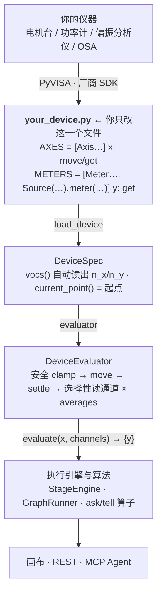

# 硬件接入接口规范（optplat device interface）

平台与硬件之间**只有一个耦合面**，且**只在一个文件里**：用户自己的设备文件。
算法、编排、画布、MCP Agent 全都只看见 VOCS + Evaluator，永远不知道下面是什么仪器。

接入 = 写一个 Python 文件，导出 `AXES`（自变量 x）和 `METERS`（因变量 y）。
平台 `load_device()` 后**自动读出有几个 x、几个 y**，据此建 VOCS、Evaluator、画布面板。
**不要为了接硬件去改平台代码**——改平台就说明契约没用对，先回来看本规范。

## 0. 三个方法就是全部契约

```
axis.move(value)   # 命令某个自变量走到某位置
axis.get()         # 读该轴当前位置 → 优化【起点】从这来（真实台架无绝对坐标）
meter.get()        # 读一次测量值
```

分层（**只有 `your_device.py` 归你写**，上面四层平台提供）：



图文版（三张图：分层 / 一次 evaluate 的时序 / 一次采集出多个 y 的三种写法对比）见
`docs/device-interface.html`，浏览器直接打开，无 CDN 离线可用。

## 1. 先做决策：用哪种接法

| 你的仪器情况 | 用什么 | 为什么 |
|---|---|---|
| 一个 y 对应一次独立读取（功率计只读功率） | `Meter(name, read_fn)` | 最简单 |
| **一次触发返回一组读数**（双通道功率计 `read()` → power1+power2；OSA 一次扫出峰值+波长+带宽） | **`Source` + `source.meter(y, key)`** | 仪器只触发一次，多个 y 来自**同一次采集**（同噪声/同时刻，物理一致），计时也只算一次 |
| 整台仪器天然 `read() -> dict`，且**每步都要全读** | `hardware.HardwareEvaluator(stage, meter)` | 老路径，但**不支持按通道选择性读取**（每步全读，浪费真实测量时间）→ 新接硬件不推荐 |

判据一句话：**只要"一次采集能出多个 y"，就必须用 `Source`**，绝不能给每个 y 各写一个 `read_fn`。

## 2. 标准写法

```python
from optplat.userdev import Axis, Meter, Source

# --- x：每个自变量一个轴 ---
class StageAxis(Axis):
    def move(self, value):  stage.move_abs(self.name, value)   # 你的电机调用
    def get(self):          return stage.position(self.name)   # 读编码器/当前位置

AXES = [
    StageAxis("x1", low=-2.0, high=6.0),          # low/high = 软件量程（进 VOCS）
    StageAxis("x2", low=-5.0, high=3.0, resolution=0.001),
]

# --- y：一次采集出多通道 → Source ---
def _read_pm():
    p1, p2 = pm.read_both()                        # 一次触发
    return {"power1": p1, "power2": p2}

pm_src = Source("pm", _read_pm, cost=1.0, device="双通道光功率计")

METERS = [
    pm_src.meter("y1", "power1", mode="maximize"),
    pm_src.meter("y3", "power2", mode="target", target=0.0),
    Meter("y2", pol.read_pdl, mode="minimize", cost=2.0, device="偏振分析仪", param="pdl"),
]
```

需要在导入时连接仪器 / 起点要读真实位置时，改用 `build()`：

```python
def build():
    stage, pm = connect_stage(), connect_meter()   # 只在这里做副作用
    return axes, meters                            # 返回 (AXES, METERS)
```

## 3. 平台会替你做的事——所以你别做

`DeviceEvaluator.evaluate()` 每次评估的固定时序：

```
安全限位 clamp → 逐轴 move → settle_time 等待
→ 重复 averages 次：{ 清掉本步用到的 Source 缓存 → 只读本步需要的通道 }
→ 求平均 → 累计测量耗时（同组并行取 max / 不同组串行相加）→ 记 history
```

由此推出**四条不变量**（违反就是接入 bug）：

| 不要做 | 原因 |
|---|---|
| ❌ 自己在设备文件里缓存读数 | 你不知道采集边界。平台在**每轮平均前**才失效缓存；你自己缓存会把 `averages=8` 退化成同一个数重复 8 次，平均彻底失效 |
| ❌ 自己做多次平均 | `averages` 由平台/画布控制，你再平均一次就是双重平均，且耗时统计不准 |
| ❌ 自己 clamp 或跳过越界指令 | 安全限位是**独立的一层**（`SafetyLimits`，可 clamp 可抛错），你在下面再夹一次会掩盖上层 bug |
| ❌ 在 `read_fn` 里移动轴 / 在 `move` 里读数 | 时序会乱：平台假设 move 与 read 分离，`settle_time` 才有意义 |

要做的：`move()` **阻塞到位**（或让平台的 `settle_time` 覆盖运动+稳定时间）；`get()` 返回**真实当前位置**，不是上次下发的目标值。

## 4. 字段速查

**Axis**（鸭子类型，可自己写类，只要有这些属性/方法）

| 字段 | 必填 | 说明 |
|---|---|---|
| `name` | ✅ | 变量名，进 VOCS，画布/图 IR 里引用它 |
| `low` / `high` | ✅ | 软件量程（算法搜索边界） |
| `move(value)` / `get()` | ✅ | 移动 / 读当前位置 |
| `resolution` | | 最小步距，供算法参考 |

**Meter**

| 字段 | 必填 | 说明 |
|---|---|---|
| `name` | ✅ | 目标名 y |
| `get()` | ✅ | 读一次（用 `read_fn` 或 `Source` 派生） |
| `mode` | | `maximize`(默认) / `minimize` / `target` |
| `target` | | `mode="target"` 时的目标值 |
| `cost` | | 读一次的秒数（耗时模型/画布预估） |
| `group` | | 同组=并行测（耗时取 max），不同组=串行（相加） |
| `device` / `param` | | 通道映射，画布上显示"哪台仪器的哪个参数" |

**Source**（一次采集 → 多通道）

| 字段 | 说明 |
|---|---|
| `Source(name, read_fn, cost, group, device)` | `read_fn()` 返回 `dict`，键即通道名 |
| `.meter(y_name, key, mode, target, cost, group, device, param)` | 把一个通道暴露成目标 y；`cost/group/device` 默认继承 Source |
| `.read()` / `.invalidate()` | 平台调用，**你不要手动调** |

同一 Source 的通道默认同 `group`（`"src:<name>"`）→ 采集时间算一次，不逐通道相加。

## 5. 接线与运行

```bash
python run_device.py 你的设备.py                    # 命令行直接跑（不依赖后端）
python run_device.py 你的设备.py my_graph.json      # 跑指定的图 IR
OPTPLAT_DEVICE=你的设备.py python -m optplat.api    # 画布/REST/MCP 全部用你的设备
```

第三种下：`/vocs` 直接返回你的 x/y，`/device` 报设备信息，起点自动取 `axis.get()`；
**`/surface` 对真实设备返回 400**（没有解析响应面，画布 2D 等高线不可用，轨迹图正常）。

## 6. 接入后必做的自检

见 `reference/checklist.md` 的冒烟脚本，逐条确认：轴能往返、`get()` 读的是真实位置、
通道选择性读取生效、`averages` 确实产生多次采集、耗时估计合理。
**先冒烟再上优化**——把接入错误和算法问题分开排查，能省掉大量在台架上的瞎试。

## 7. 相对起点（真实台架的关键差异）

真实台架**没有绝对坐标**，优化起点默认取 `axis.get()` 的当前位置。所以扫描/拟合类算子要用
**相对窗口** `span_frac > 0`（0 = 全程绝对扫描）；注意 `span_frac=1` 是以起点为中心 ±半量程，
起点恰在量程中点时看起来跟全程一样——要局部扫就用小值（0.2~0.6）。

## 8. 接完硬件的第一件事：灵敏度采集

冒烟通过之后**先测再调**。灵敏度采集回答三个直接决定后续参数的问题：

| 问题 | 采集给出的答案 | 拿它干什么 |
|---|---|---|
| 动 x 一个单位，y 变多少？ | **∂y/∂x 灵敏度矩阵** | 直接喂 `damped_sensitivity` 做多进多出定值；也用来判断哪个轴根本没响应（接错线/没使能） |
| 这段能当线性用吗、多宽？ | **实测线性范围** + R² | 决定扫描/精调的步距与窗口：步距要落在线性范围内，否则拟合和梯度都会失真 |
| 换个工作点还成立吗？ | **多原点的矩阵漂移** | 漂移 >20% 说明非线性强，一个全局矩阵不够用，要分段/按工作点建模 |

**怎么跑**（三个入口同一套核心）：

```bash
# 画布：顶栏『📐 灵敏度采集』——勾 x/y，填原点、步距、点数，出曲线 + 矩阵
# REST：
curl -X POST localhost:8003/sensitivity -H 'Content-Type: application/json' -d '{
  "variables":["x1","x2"], "objectives":["y1","y2"],
  "step":0.2, "n_points":7, "origins":[{"x1":2,"x2":0}], "fit":"linear"}'
# 流程内（单原点）：加一个 `sensitivity_scan` 节点
# Agent：MCP 工具 measure_sensitivity
```

**参数怎么选**（真实台架上别拍脑袋）：

- **步距**：先取"预计线性范围"的 1/4 左右。太小 → 信噪比不够，斜率被噪声主导；
  太大 → 扫出线性区，斜率被非线性拉偏。拿不准就先用大点数小步距扫一遍看曲线。
- **点数**：奇数（含原点）。5~9 足够；要看清弯曲用 9~15 并选二次拟合。
- **噪声大时**把 `averages` 调大而不是加点数——平均降噪 √N，加点数只是让拟合更平滑。
- **二次拟合**时斜率取的是**原点处的导数**，曲线弯的时候比整段直线更接近真实局部灵敏度。

**结果怎么读**：

- `linear_range` 是**实测**的：以原点切线为基准向两侧外扩，直到偏离 > `linear_tol × y跨度`。
  它比你扫描的范围窄是正常且有用的信息——那才是"能当线性用"的区间。
- `r2` 低 + `linear_range` 窄 → 别在这个工作点用拟合定峰或阻尼灵敏度，先缩小步距或换工作点。
- 某格 ∂y/∂x ≈ 0（summary 会写"几乎无响应"）→ 先怀疑接线/使能/量纲，而不是急着调算法。
- 采集**结束会自动回到原点**，机构不会停在最后一个扫描点。

**注意**：安全限位在 Evaluator 层是**静默 clamp** 的。采集侧会先按 VOCS 量程夹一次并给出
`warnings`，但如果你的 `SafetyLimits` 比量程更紧，被夹住的点会让该段斜率偏小而不报错。
第一次采集建议步距取小、看 warnings 是否为空。

## 更细的规范

- `reference/interface.md`：逐字段完整语义、平台侧调用时序、`Source` 缓存边界的精确定义、
  与 `HardwareEvaluator` 老路径的差异。
- `reference/checklist.md`：接入冒烟脚本、常见错误症状→原因对照表。
- `reference/sensitivity.md`：灵敏度采集的完整用法——参数选取、结果字段逐条解释、与阻尼灵敏度求解的衔接、常见误读。
- `examples/device_template.py`（仓库内）：可直接复制的起点文件。
